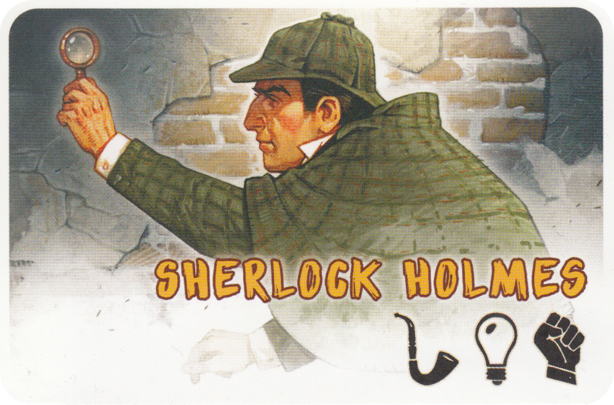

# Sherlock 13

## Manuel d'utilisation : 
Executez cmd.sh avec la commande `sudo bash ./cmd.sh` (sous linux) pour compiler le code et lancez server avec `./server {port_serveur}`.
SH13 est un jeu qui se joue à 4, il faut donc ouvrir 4 terminaux et exécuter 4 fois:
`./sh13 localhost {port_serveur} localhost {port_client1} {Nom_Joueur}` 

## Regles : 
A chaque partie, une carte suspect est posée face cachée au centre de la table. Elle représente le coupable.
Le reste des cartes est réparti entre les joueurs.

A son tour, le joueur réalise une action parmi les 3 possibles :

 * Interroger tous les joueurs sur un symbole. Les joueurs lèvent la main s’ils possèdent ce symbole. Mais sans en préciser la quantité.
 * Interroger un joueur à propos d’un symbole spécifique. Le joueur devra indiquer le nombre exact de ce symbole qu’il possède.
 * Accuser un suspect. Il vérifie alors discrètement la carte coupable.
Si la réponse est juste, il gagne la partie. Si la réponse est fausse, il est éliminé.
Mais il devra continuer à répondre aux questions de ses adversaires.

(D'après [https://www.alkarion.com/produit/sherlock-13-jeu-de-societe/](www.alkarion.com))

## Explications Techniques : 
### Côté Serveur : 
Le programme commence par la configuration d'un socket serveur en utilisant la fonction `socket` avec le protocole de transport `SOCK_STREAM` pour des connexions TCP. La structure `struct sockaddr_in` est ensuite utilisée pour spécifier les détails du serveur tels que l'adresse IP, le numéro de port, et le type de protocole (`AF_INET` pour IPv4). La fonction `bind` attache le socket à l'adresse et au port spécifiés, et `listen` prépare le socket pour l'écoute des connexions entrantes.

Le code utilise la fonction `accept` pour accepter les connexions entrantes des clients, créant ainsi un nouveau socket pour chaque client. Ces sockets sont ensuite utilisés pour la lecture et l'écriture de données entre le serveur et les clients.

La communication entre le serveur et les clients est principalement basée sur des messages textuels. Les fonctions telles que `read` et `write` sont utilisées pour échanger des données entre le serveur et les clients via les sockets. Les messages comprennent des informations sur les joueurs, les cartes, l'état du jeu, etc.

Les fonctions auxiliaires telles que `sendMessageToClient` et `broadcastMessage` utilisent ces sockets pour envoyer des messages à des clients spécifiques ou à tous les clients connectés, respectivement. 

### Côté Client : 

Le client contient une interface graphique réalisée avec la library SDL. La communication avec le serveur est également une connexion TCP classique. L'ensemble de l'interface graphique est codé dans la fonction main, de même que la logique de reception de buffer.
### Protocole de Communication 
Voici une liste expliquant chaque type de gbuffer dans le protocole de communication client/serveur pour un jeu :
#### Côté Client :
 * *'I' :* Envoie de l'Id du joueur au client.
     ```c
     sscanf(gbuffer, "I %d", &gId);
     ```

 * *'L' :* Le joueur reçoit la liste des joueurs.
     ```c
     sscanf(gbuffer, "L %s %s %s %s", gNames[0], gNames[1], gNames[2], gNames[3]);
     ```

 * *'D' :* Le joueur reçoit ses trois cartes.
     ```c
     sscanf(gbuffer, "D %d %d %d", &b[0], &b[1], &b[2]);
     ```

 * *'M' :* Le joueur reçoit le n° du joueur courant.
     ```c
     sscanf(gbuffer, "M %d", &currentPlayer);
     ```

 * *'V' :* Le joueur reçoit une valeur de tableCartes.
     ```c
     sscanf(gbuffer, "V %d %d %d", &player, &symbole, &valeur);
     tableCartes[player][symbole] = valeur;
     ```

#### Côté Serveur :
 * *'C' :* Le serveur reçoit la demande de connexion d'un joueur.
     ```c
     sscanf(buffer,"%c %s %d %s", &com, clientIpAddress, &clientPort, clientName);
     ```

 * *'G' :* Le serveur reçoit la tentative d'un joueur de jouer une carte.
     ```c
     sscanf(buffer, "G %d %d", &id, &card);
     ```

 * *'O' :* Le serveur reçoit une demande d'ouverture d'une carte par un joueur.
     ```c
     sscanf(buffer, "O %d %d", &id, &symbole);
     ```

 * *'S' :* Le serveur reçoit l'annonce d'une victoire d'un joueur.
     ```c
     sscanf(buffer, "S %d %d %d", &id, &joueur, &symbole);
     ```
